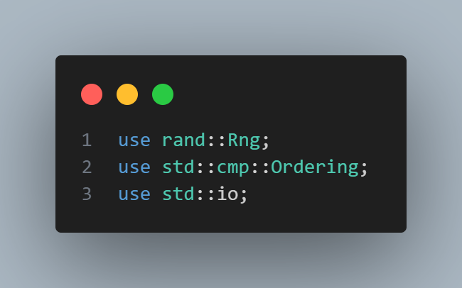
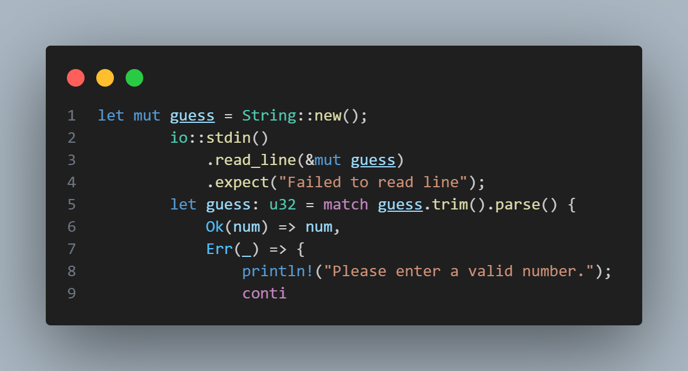

What i understood from chapter 2 and 3 from rust official book 

Chapter 2
1- I understood the importance of all the library imported in the     code base and how they were been used in different 

use std::io; - For handling user input.
use rand::Rng; - To generate a random number.
use std::cmp::Ordering; - To compare the user's guess with the secret number.

2- I learned how loop works based on chapter 2. it kept the game alive until the user guessed the right number.

3- Basic Error handling in rust: 

i was able to understand how error handling work by using the .expect() which throw back a clear custom error message

so in all i learnt about library usage, error handling and also how expression works using loop and also about the break keyword

CHAPTER 3

1- I learnt about variable mutability: where at first all variable are immutable by default meaning they cant be changed unless the mut keyword is added to the vairable. and also about the const keyword where the variable cant be changed and we are not allowed to use mut

2- Also learnt about shadowing in rust and how it works

3- The different data types in rust 
The scalar type and the compound type
examples of scalar include int,bool,char,floating point
the compound type iclude tuples and arrays

4- I also learnt about function, parameters

5- i also learnt about comments and control flow
the if statement, else if statement, loops