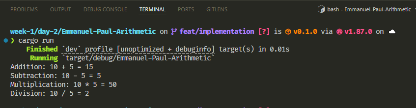

# Arithmetic Operations in Rust

This project demonstrates basic arithmetic operations implemented in Rust, including addition, subtraction, multiplication, and division.

### Source Code

The main logic is implemented in [`src/main.rs`](src/main.rs).

### Output

To see the output, run the program. The results will be printed to the console, showing the results of each arithmetic operation.

You can also view a sample output below:

