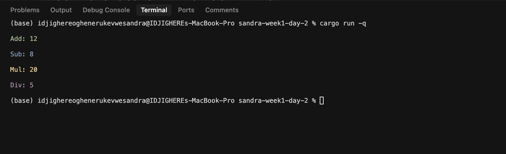

# Task 1: Study Chapters of The Rust Book,Study the **remaining of Chapter 2** and **all of Chapter 3** of [The Rust Programming Language](https://doc.rust-lang.org/book/)

## Solution

### Chapter 2

1)shadowing
2)Trim()
3)parse()
5)match + result

1. Use cargo new to scaffold a project; run it with cargo run
   The part was very easy to understand and pretty straight foward

Bring in dependencies: std::io, rand, and std::cmp::Ordering, th

Read user input with io::stdin().read_line(&mut guess) and handle potential errors using .expect()

Convert the input string to a number using .trim().parse(), matching on Ok(num) or Err(\_)

Use match guess.cmp(&secret_number) to compare guesses and give feedback (Less, Greater, Equal)

This chapter also introduces methods, associated functions, and external crates at a high level

Takeaways:
Practice with basic I/O, error handling (Result), conditionals (match), loops, and modular project organization.

# Task 2: Basic Arithmetic in Rust

## Solutions

### `add(a: f32, b: f32) -> f32`

Performs addition of two floating-point numbers.

### `sub(a: f32, b: f32) -> f32`

Performs subtraction of two floating-point numbers.

### `mul(a: f32, b: f32) -> f32`

Performs multiplication of two floating-point numbers.

### `div(a: f32, b: f32) -> f32`

## Screenshot of Program Output

_Screenshot showing the c program output with colored results for each arithmetic operation_
